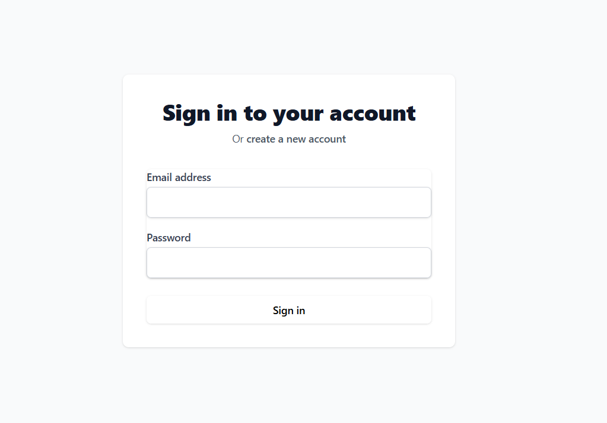
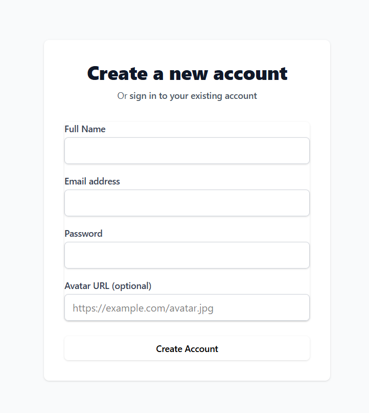
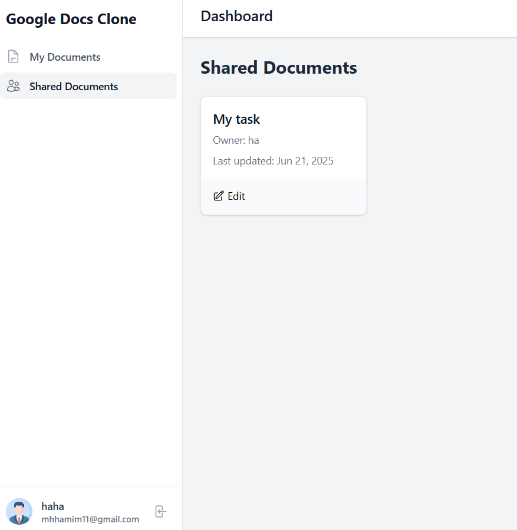
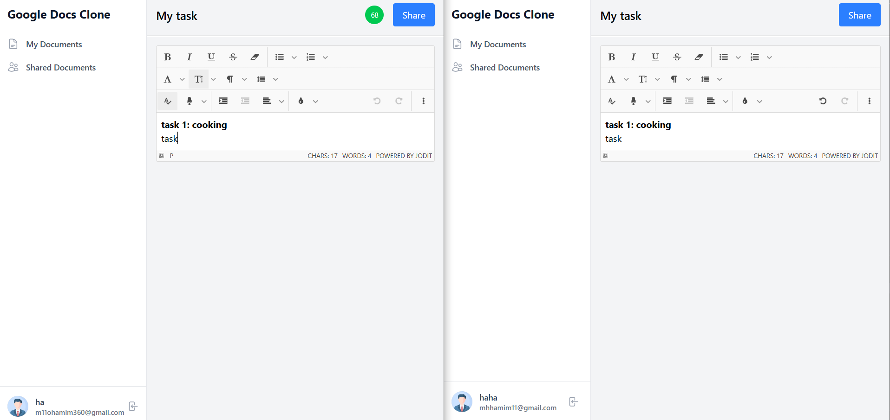
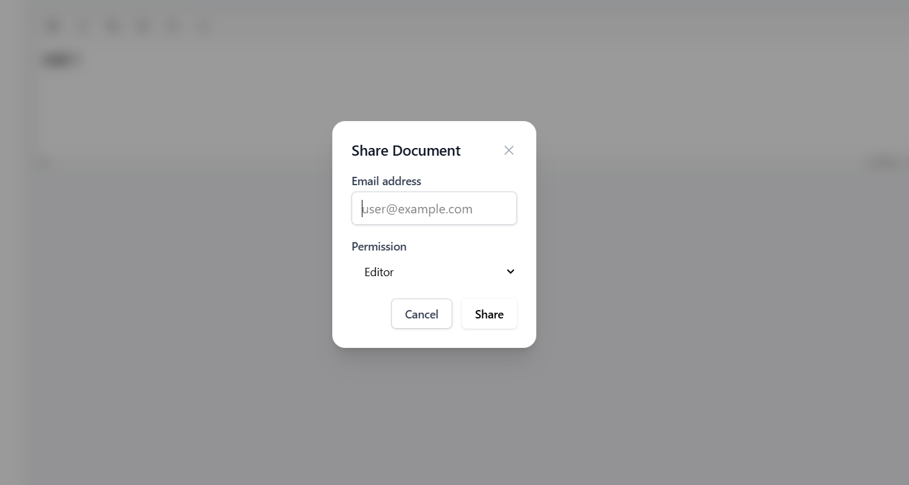

# Google Docs Clone — Frontend

A real-time collaborative document editing app built using **Next.js** and **Tailwind CSS**, mimicking core features of Google Docs.

This project allows users to create, edit, and share rich-text documents in real time with live multi-user collaboration using **Socket.IO**. Designed as a 6-day MVP sprint.

---
## 🔗 Useful Links

> **Live App:** [google-docs-frontend-chi.vercel.app](https://google-docs-frontend-chi.vercel.app/)

> **GitHub Repo:** [github.com/mohamim360/GoogleDocs-frontend](https://github.com/mohamim360/GoogleDocs-frontend)

> **Live API:** [googledocs-backend-smh1.onrender.com](https://googledocs-backend-smh1.onrender.com/)

> **GitHub Repo:** [github.com/mohamim360/GoogleDocs-backend](https://github.com/mohamim360/GoogleDocs-backend)
---

## ✨ Features Showcase

### 🔐 Authentication (JWT with Avatar Upload)





* Sign up with name, email, password, avatar
* JWT-based authentication
* User context persists across sessions

---

### 📄 My Documents


* View all documents created by the logged-in user
* Create, edit, or delete documents
* Auto-saves as you type

---

### 📤 Shared Documents



* Documents shared **with you** by other users
* Displays owner and permission level (viewer/editor)

---

### ✍️ Real-Time Editing



* Live collaboration via **Socket.IO**
* Rich-text editor using **jodit.js**
* Auto-save 

---

### 🤝 Document Sharing & Permissions



* Share documents via email
* Assign permissions: **Editor** or **Viewer**
* Role-based access enforced in UI and backend

---

## 🧪 Tech Stack

* **Framework:** Next.js 14 (App Router, client/server components)
* **Styling:** Tailwind CSS
* **Editor:** Quill.js
* **Real-Time:** Socket.IO
* **State:** React Context (Auth)

---

## 🛠️ Local Development

```bash
# 1. Clone the repo
git clone https://github.com/mohamim360/GoogleDocs-frontend.git

# 2. Install dependencies
cd GoogleDocs-frontend
npm install

# 3. Create .env.local
NEXT_PUBLIC_API_URL=https://googledocs-backend-smh1.onrender.com

# 4. Run the app
npm run dev
```

---

